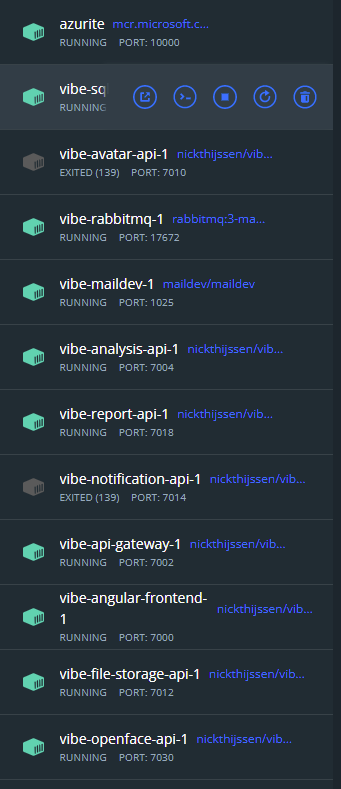
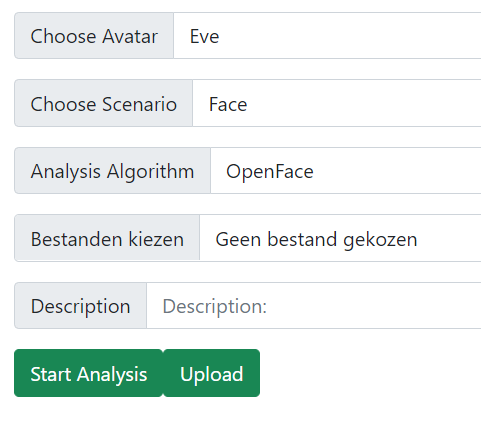
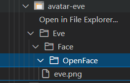
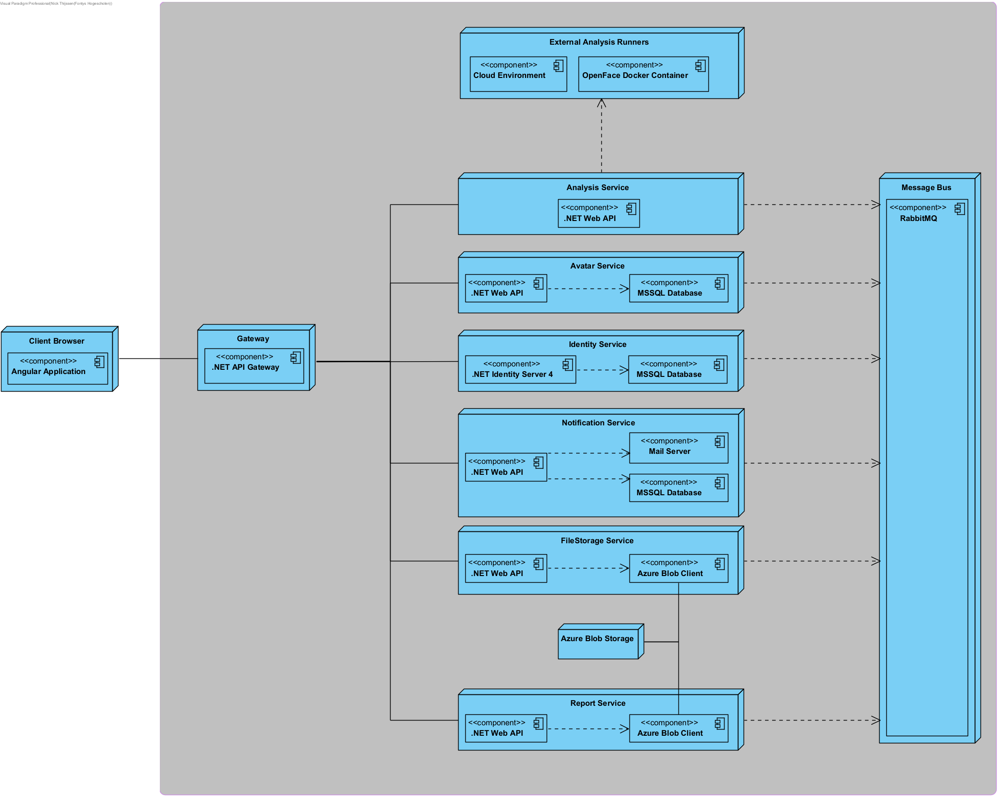

<div id="top"></div>
<h1 align="center">Vibe Validation Pipeline</h1>

<!-- ABOUT THE PROJECT -->

## About The Project

The VIBE project is a collaboration between various educational and corporate partners such as Fontys, BUAS, Tilburg
University and BlueTea. Its goal is to create autonomous, AI-driven avatars that can be used in social interactions
within the context of medical procedures or training. The goal of this pipeline is to aid in acquiring metrics on the
facial expressions of these avatars and compare these to a given set of parameters to aid in their development.

For more info, see the created [portfolio](https://teaguemm.gitbook.io/internship-avatar-pipeline/).

### Project File Structure

The root directory of this repository contains five subdirectories.

- **VIBEBackend**: Contains all .NET services, API Gateway and libraries projects. Also contains the solution file.
- **frontend-vibe**: Contains the Angular project for the frontend web application.
- **file-samples**: Contains some example avatar images for testing and development
- **doc-images**: Contains images and files that are used in README's.
- **.github/workflows**: Contains the files used by GitHub for the CI/CD pipeline

### Run Project Locally With Docker

Open a terminal in the root directory of the repository.
This is the directory that contains this README file, the docker-compose files and the subdirectories file-samples,
frontend-vibe and VIBEBackend.

First build the docker images:

```powershell
docker compose build
```

This will build all images for the backend (Api Gateway and Microservices) and frontend, and will download all
dependency images like MSSQL and Azurite.

To start the project, use the following command in the root directory of the project:

```powershell
docker compose --env-file .env -f docker-compose.yml -f docker-compose.override.yml up -d
```

You can also use the simpler command:

```powershell
docker compose up -d
```

#### Issues with docker compose

When running the project with docker compose for the first time, the Avatar and Notification services might not start.
This happens because the MSSQL Server is not completely started yet.



To fix this, restart these two services again, or start all infrastructure containers first and afterwards the project
containers. You can start the infrastructure containers with:

```powershell
docker compose -f docker-compose-infrastructure.yml up -d
```

To stop all containers, enter the command:

```powershell
docker compose down
```

When you made changes to one or multiple services, you need to rebuild its docker image. Do this with the following
command:

`docker compose build <service-1> <service-2>`

Replace <service-1>, <service-2> or more with the name (in the docker-compose file) of the service that you changed.

### Run Project Locally With IDE

When you don't want to run the backend and/or frontend in docker containers, you will still need a running
infrastructure.
For this there is a special docker compose file. Run them with the following command:

```powershell
docker compose -f docker-compose-infrastructure.yml up -d
```

This will create and run the MSSQL Database, Azurite Storage, Mail Server, RabbitMQ and the OpenFace API docker
containers.

You can now start all microservices and the frontend from within your IDE.

## Analysis Pipeline Flow

The base of the application is the analysis pipeline. This pipeline consists of a set of steps that are executed in
order. How this pipeline works and which steps are taken, is described in detail here.

1. A user uploads a set of images or videos containing recordings of an avatar. The files, together with the analysis
   settings is send to the FileStorageService.



2. The FileStorageService saves the files in an Azure Blob Storage. Every avatar has a separate blob container with the
   name `avatar-<name>`. The files are saved in a folder structure that is based on the analysis parameters.



3. When the FileStorageService successfully saved the file(s), it sends a message to the RabbitMQ bus with the
   information
   of the added file(s). The AvatarService is set to listen to this type of message.
4. The AvatarService manages all information about avatars and its relations to other resources. It is connected to a
   database in which it stores some
   information about an avatar like its name, a list of analysis done for this avatar and the files that belong to a
   specific analysis. Important to note is that it doesn't store the content of these files itself (this is what the
   FileStorageService is for), it only stores the
   link to a file. When it receives the message from the FileStorageService that a new file is added, it adds a link to
   this file to the specific avatar.
5. When the AvatarService successfully saved the information that a new file is added to an avatar, it sends a message
   to the RabbitMQ bus to trigger an analysis for the uploaded files. This message contains the files that need to be
   analysed, which algorithm needs to be used and other parameters necessary for the analysis. The AnalysisService
   listens to this type of message.
6. The AnalysisService is responsible for triggering specific analysis algorithms and listening to there progress. The
   actual analysis is not done by this service itself, but is executed by separate docker containers, in a cloud
   environment or external
   providers. The AnalysisService is in this sense only a mediator or orchestrator. When the AnalysisService received a
   request for starting a new analysis, it delegates it to the right analysis runner and sends a message to the RabbitMQ
   bus when it is finished (or something went wrong).
7. The NotificationService listens to messages from for example the AnalysisService. When it receives a message that an
   analysis is finished, it can send an email to the user that started the analysis. This service is further responsible
   for other notifications that need to be send by email or for example in real time to the frontend.
8. The ReportService is responsible for retrieving the results of an analysis and converting raw data to a more user
   friendly
   format. For example, when requesting the output from an OpenFace analysis, it retrieves the generated CSV file,
   formats it, and sends the formatted data back. The output from different analysis tools or algorithms are probably in
   completely different formats or file types. For every analysis tool, a new formatter needs to be implemented.

## Infrastructure

The following diagram shows how all separate components of the project are connected.



Some microservices depend on one or more other services to function. What services are needed and how they work is
explained in detail in the README files found in the folder of every separate service.

# Issues

- **OpenFaceService Cannot Run Locally**: More info can be
  found [here](./VIBEBackend/OpenFaceService/README.md#running-locally-currently-not-possible).
- **Proper file handling**: Uploading an exising file, unsupported file types or corrupt files might break the pipeline.

# Missing Features

- **Authentication & Authorisation**
- **Real time analysis progress status and feedback**
- **Provide feedback for algorithms**: It is currently not possible to mark false-positives or false-negatives in any
  way.
- **Algorithm Selection**: The AnalysisService and ReportService are currently hardcoded for OpenFace. They need to be
  extended for supporting other algorithms.
- **Uploading multiple files or a folder**: The FileStorageService is able to receive multiple files, but needs testing
  and optimization for very large files. It's also only able to upload directly chosen files, but not for example
  selecting a folder.
- **Avatar Versioning**: Currently there is no versioning available for an avatar. All files and analysis results are
  only seperated for every avatar and the specific analysis that was run.

# Recommendations

- Instead of uploading files by using the web application, a better solution might be to use something similar to how
  OneDrive or Google Drive work. This way avatar developers can connect directly to the file storage, which can make
  uploading, downloading and structuring the files easier and probably also faster.
- Creating an abstraction library for file storage. For this project, Azure Blob Storage was used as a file storage method. It
  would be better to create an abstraction between the FileStorageService and the chosen implementation so it is
  possible to switch to a different storage system.
- The API gateway has different files for specifying the routes depending on if it is running locally or in docker. This
  could be improved by merging them to one file and making the host URL configurable.

