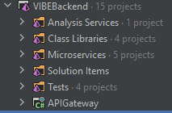

# Vibe Backend

This solution contains all microservices, custom libraries and the API gateway to which the frontend web application
connects.

Currently there are five microservices that handle all the logic for uploading files, starting analysis, sending
notifications and structuring all information about all avatars. These microservices provide the backbone of the avatar
validation pipeline.

Next to these microservices, there is one analysis service that actually runs an analysis using OpenFace.

A small description of what every single microservices does will be given here. You will find
a more detailed description in the README files that are found in the folder of every service. How all services connect
to each other and work together, is documented in the main README file [here](../README.md#analysis-flow).

When opening the solution in Visual Studio or Intellij Rider, it will show a different structure using solution folders.
This is not visible in the file structure itself. The solution structure is used in this article for clarity.

## APIGateway

The API gateway is the entrypoint for the frontend application and makes sure all requests to it are routed to the right
microservice. It uses Ocelot and provides a Swagger UI for development purposes. The routes can be found in the ocelot.*
.json files.
It doesn't have any other logic besides this and is thus fairly simple and small.

## Microservices

### FileStorageService

This service provides an API for uploading and retrieving files to an Azure Blob Storage. The reason for adding a
separate microservice
for this functionality, is that file handling can be difficult to implement and might need complicated logic for
validating file formats or malware detection. When working with big files, it will also need optimization for processing
and saving.

Currently Azure Blob Storage is used for file storage. This can be changed to an other storage service or extended to
support multiple options.

### AvatarService

This service is used for handling all metadata about an avatar like its name, thumbnail, id and other information
related to it. It is largely a simple CRUD API for avatar data.

### AnalysisService

This service can be thought of as a API gateway for different analysis algorithms. Currently, there is only one analysis
algorithm used, namely OpenFace. In the future more algorithms are probably added or external services might be used.
This services job is to provide an API for choosing which algorithm must be run and what parameters it needs. It will
then trigger the chosen algorithm and track its progress.

### ReportService

This service was added to be able to retrieve results from a specific analysis and format them to a more human friendly
format. Because different algorithms produces results in al kinds of formats and save them in different file types, this
service provides a way of unifying all the raw data. Currently, it is only able to read the results from the OpenFace
algorithm which is stored in a CSV file, but in the future it can be extended depending on which algorithms are added to
the project.

### NotificationService

This service is used to send notifications to the frontend application or to users in other ways when a analysis is
finished. It currently only sends an email, but can be extended with other notification methods. The current project
lacks real time feedback of the state of a running or finished analysis. It is advised to add for example SignalR to
this service to be able to send real time information to the frontend.

## Class Libraries

### FileStorage

This library contains the code needed for saving and retrieving files from Azure Blob Storage. Microsoft provides it's
own library for setting up a connection and handling containers and blobs. This library builds upon this and adds an
abstraction specifically for this project. It makes it easier to connect to a Blob Storage and search for files or work
with folders.

### MessagingNetwork

This library is used by almost all microservices for connecting and sending and receiving messages over RabbitMQ. It
contains some classes for serializing and deserializing messages and handling the connection startup. It also contains
the classes that describe the messages that are used in this project.

## Analysis Services

Currently the project contains only one analysis algorithm that is accessible via a REST API. It uses the original
OpenFace docker image to which a .NET API is added for access. In the future, other algorithms might be added or a
solution from an external provider might be used. It is advised to add new algorithms to this solution folder and not to
the Microservices folder for clearer separation between the two.
